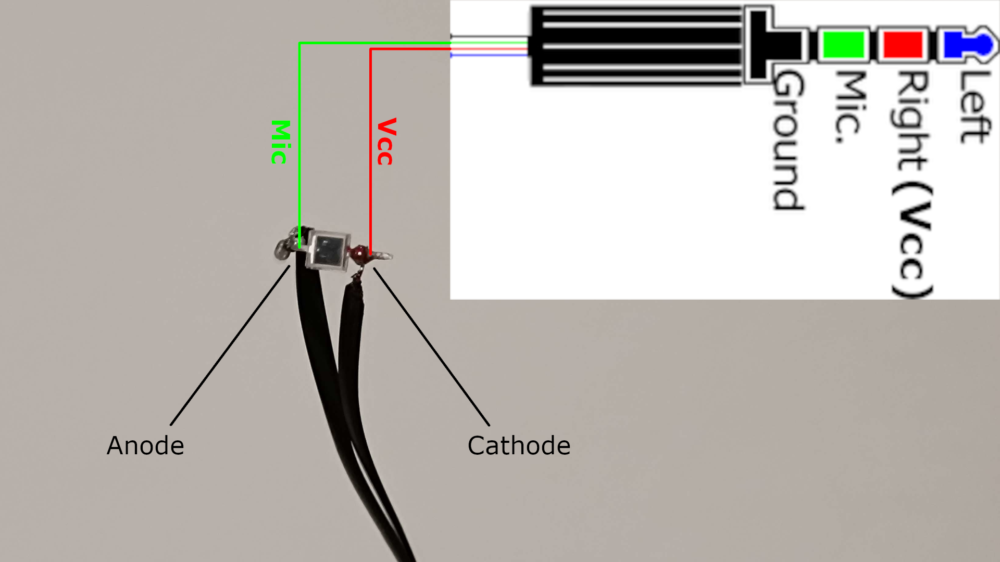

[VIDEO](https://youtu.be/8AKe_MFNqVc)

Latency measuring software for OpenLatency measuring device:

# Building the device:

1) Get a photodiode
2) Get a 3.5mm TRRS audio cable (like from a headset or earbuds with a built-in mic which you don't use)
3) Strip mic & Vcc cables (you can check which one is mic and which is Vcc by touching the conductors of each cable while connected to PC 3.5mm mic/dual audio port and looking at [mic input level](https://github.com/GeeTwentyFive/OpenMicDataDumper))
4) Connect mic cable to photodiode's anode, and Vcc cable to photodiode's cathode ([example](docs/OpenLatency-Measurer.png))

# USAGE:

1) Connect latency measurer to 3.5mm mic/dual jack
2) Make sure it is set as default audio input device
3) Start OpenLatency
4) Set minimum trigger difference for measurement (lower = more sensitive trigger, higher = less sensitive trigger) (Ex.: "18" works well for my BPW34 photodiode)
5) Hold measuring side of potodiode against target screen
6) Click to measure

You can use [this tool](https://github.com/GeeTwentyFive/OpenLatencyTester) to both test if it works *and* measure system latency.

# Building the program:

You don't have to build the program if you just want to use it. You can get a pre-built executable binary release [here](https://github.com/GeeTwentyFive/OpenLatency/releases/latest) *(currently only a pre-built Windows release)*.

Windows: `cc -O3 src/main.c -Lexternal/libuiohook -luiohook`

For Linux, Mac, & other: You might have to include additional libraries. Consult [libuiohook](https://github.com/kwhat/libuiohook?tab=readme-ov-file#compiling) & [miniaudio](https://github.com/mackron/miniaudio?tab=readme-ov-file#building) documentation for this.

## Notes:

- Since it starts measuring from the hook part (Input -> OS -> Hooks -> Other non-hook application(s) -> GPU -> Display), USB mouse polling rate doesn't affect measurement result.
